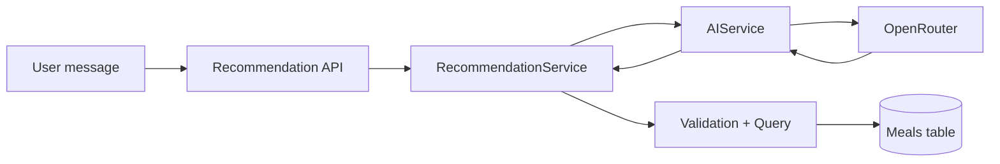
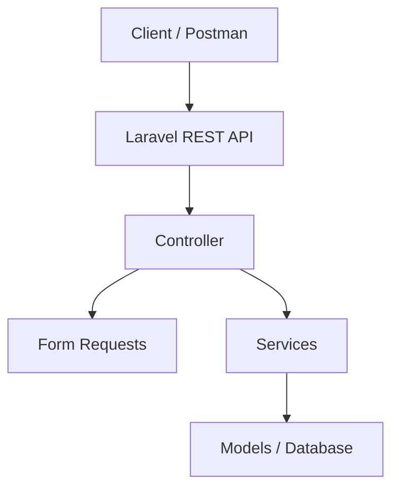
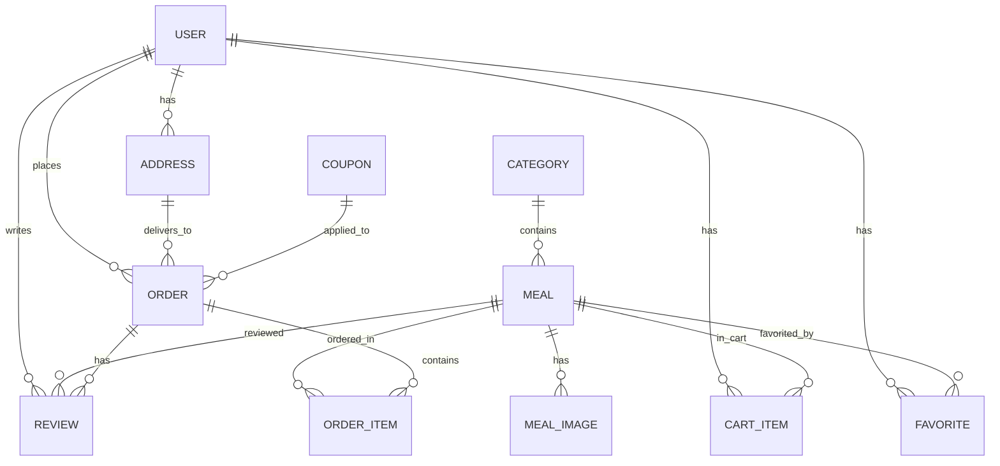

# MealHub

MealHub is a Laravel-based restaurant ordering and management platform, built around a RESTful API and a Filament admin dashboard. It covers catalog browsing, user accounts, cart, coupons, orders, reviews, and a stateless AI meal recommendation feature powered by real menu data.

## Overview

- Customers register/login via Sanctum, browse categories & meals, manage addresses and favorites, use a cart, apply coupons, place orders, and leave reviews.
- Admins manage the platform through a Filament dashboard with resources, stats, and order workflows.
- An AI recommendation endpoint interprets natural-language requests and returns real, in-stock meals — never invented ones.

## Key Features

| Module | Highlights |
|---|---|
| **Auth & Users** | Sanctum-based registration/login/logout, profile update, password change |
| **Categories & Meals** | Filtering, sorting, search, featured/available flags, images |
| **Addresses** | CRUD with a single enforced default address per user |
| **Favorites** | Unique per user/meal, with a check endpoint |
| **Cart** | Add/update/remove/clear, stock validated (no stock deducted here) |
| **Coupons** | Status, validity window, usage limit, min-order, % or fixed discount |
| **Orders** | Transactional creation, item snapshots, cancellation, status tracking |
| **Reviews** | Only for meals in delivered orders, triggers rating recalculation |
| **Admin (Filament)** | Resources for Users, Categories, Meals, Orders, Reviews, Addresses, Coupons + dashboard widgets |
| **AI Recommendations** | Stateless, natural-language input, validated against real DB data |

## AI Meal Recommendation

`POST /v1/ai/recommendations` → `RecommendationController` → `RecommendationService` → `AIService` → OpenRouter.

The AI returns structured JSON (budget range, category hint, preference tags, reason). Laravel validates this output and queries the real `Meal` model (`is_available`, `stock_quantity > 0`, category/budget match) before returning results — the AI never creates meals, prices, or stock data.



## Architecture



**Structure:** `app/Models`, `app/Http/Controllers/Api/V1`, `app/Http/Requests`, `app/Http/Resources`, `app/Services`, `app/Filament`, `database/migrations`, `database/seeders`, `routes/api.php`, `docs/postman`.

## Database

**Entities:** `users`, `categories`, `meals`, `meal_images`, `addresses`, `favorites`, `cart_items`, `coupons`, `orders`, `order_items`, `reviews`



## API Reference

Base path: `/api/v1`

| Method | Endpoint | Auth | Description |
|---|---|:---:|---|
| POST | `/register` | No | Register a new user |
| POST | `/login` | No | Login, receive Sanctum token |
| POST | `/logout` | Yes | Revoke current token |
| GET | `/profile` | Yes | Get authenticated user |
| PUT | `/profile` | Yes | Update profile |
| PUT | `/change-password` | Yes | Change password |
| GET | `/categories` | Yes | List categories |
| GET | `/categories/{slug}` | Yes | Show category |
| GET | `/meals` | Yes | List/filter/search meals |
| GET | `/meals/{slug}` | Yes | Show meal |
| GET | `/addresses` | Yes | List addresses |
| POST | `/addresses` | Yes | Create address |
| GET/PUT/DELETE | `/addresses/{address}` | Yes | Show/update/delete |
| PATCH | `/addresses/{address}/set-default` | Yes | Set default |
| GET | `/favorites` | Yes | List favorites |
| POST | `/favorites` | Yes | Add favorite |
| DELETE | `/favorites/{meal}` | Yes | Remove favorite |
| GET | `/favorites/check/{meal}` | Yes | Check favorite status |
| GET | `/cart` | Yes | Cart summary |
| POST | `/cart/items` | Yes | Add item |
| PATCH | `/cart/items/{meal}` | Yes | Update quantity |
| DELETE | `/cart/items/{meal}` | Yes | Remove item |
| DELETE | `/cart/clear` | Yes | Clear cart |
| POST | `/coupons/validate` | Yes | Validate coupon |
| POST | `/orders` | Yes | Create order from cart |
| GET | `/orders` | Yes | List user's orders |
| GET | `/orders/{order}` | Yes | Show order |
| PATCH | `/orders/{order}/cancel` | Yes | Cancel eligible order |
| GET | `/meals/{meal}/reviews` | No | List reviews for a meal |
| POST | `/meals/{meal}/reviews` | Yes | Create review (delivered orders only) |
| GET | `/reviews/{review}` | No | Show review |
| PUT/DELETE | `/reviews/{review}` | Yes | Update/delete own review |
| POST | `/ai/recommendations` | No | Get AI meal recommendations |

## Business Logic

- **Effective price:** `discount_price` used when set, else falls back to `price`.
- **Stock:** not deducted on cart add/update — only decremented in `OrderService::createOrder()` inside a DB transaction.
- **Coupons:** validated for status, window, usage limit, min-order, and capped discount.
- **Reviews:** restricted to meals from delivered orders, one per order/meal; ratings recalculated on write/update/delete.
- **Addresses:** first address is default automatically; setting a new default resets others; deleting the default promotes the latest remaining one.
- **Favorites:** unique per `(user_id, meal_id)` at both DB and service level.

## Admin Dashboard

Filament panel at `/admin`, configured in `AdminPanelProvider`. Includes resources for Users, Categories, Meals, Orders, Reviews, Addresses, and Coupons, plus dashboard widgets (revenue, order status, top-selling meals, recent orders/customers). Order status transitions (`Pending → Confirmed → Preparing → Out for Delivery → Delivered`) are handled via `OrderService::updateStatus()`.

## API Testing

A Postman collection is available at `docs/postman/MealHub.postman_collection.json`, covering all modules including AI recommendations. Import into Postman and set the `local_url_v1` and `token` environment variables.

## Installation

```bash
git clone <repository-url>
cd MealHub

composer install
cp .env.example .env
php artisan key:generate

# configure DB_* values in .env

php artisan migrate
php artisan db:seed
php artisan storage:link

npm install
npm run build

php artisan serve
```

## Environment Variables

```env
APP_NAME=MealHub
APP_ENV=local
APP_KEY=
APP_URL=http://localhost

DB_CONNECTION=mysql
DB_HOST=127.0.0.1
DB_PORT=3306
DB_DATABASE=mealhub
DB_USERNAME=root
DB_PASSWORD=

OPENROUTER_API_KEY=your_api_key_here
AI_BASE_URL=https://openrouter.ai/api/v1
AI_MODEL=openai/gpt-4o-mini
AI_TIMEOUT=15
AI_RETRIES=2
AI_RETRY_DELAY_MS=200
```

## Testing

Only default Laravel/Pest scaffold tests exist (`tests/Feature/ExampleTest.php`, `tests/Unit/ExampleTest.php`) — no dedicated business-logic test suite yet.

```bash
php artisan test
```

## Security

- Sanctum token authentication
- Form Request validation on all mutating endpoints
- Ownership checks on addresses, orders, and reviews
- Rate limiting on favorites (`throttle:60,1`)
- Secrets kept in environment variables, not source control

## Future Improvements

- Automated test coverage for business logic
- CI/CD pipeline
- Order/review notification system
- OpenAPI/Swagger documentation
- Extended AI personalization

## Developer

**Abdallah Wael Abdelaziz Abdelfattah**
Backend Developer | PHP & Laravel